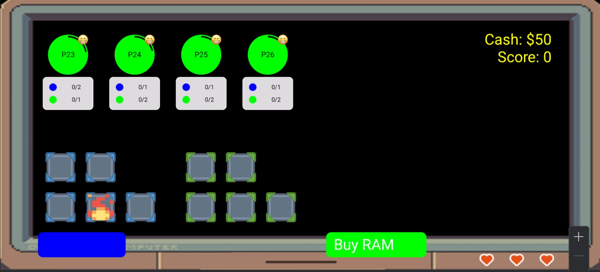

# CS205 G1T2 — Android 2D Game

A real-time 2D Android game developed for **CS205: Operating System Concepts** at Singapore Management University (SMU). The project explores core OS concepts such as threading, concurrency, and the Android game loop within the context of an interactive mobile game.

---

## About

This game was built as part of the CS205 module, which covers operating system principles applied in the Android environment. The project demonstrates practical use of:

- **Game loop architecture** using Android's `SurfaceView` and threading model
- **Concurrency and thread management** to handle game state updates and rendering separately
- **Canvas-based 2D rendering** for real-time graphics
- **User input handling** via touch events

---

## Screenshots

| Home Screen | In-Game Screen |
|:-----------:|:--------------:|
|  |  |

> To update these images, add your screenshots to a `screenshots/` folder in the root of the repository and name them `home_screen.png` and `ingame_screen.png`.

---

## Getting Started

### Prerequisites

- [Android Studio](https://developer.android.com/studio) (Hedgehog or later recommended)
- Android SDK (API Level 21+)
- Java Development Kit (JDK 11+)

### Installation

1. Clone the repository:
   ```bash
   git clone https://github.com/tzejunw/CS205-G1T2.git
   ```

2. Open the project in Android Studio:
   - Launch Android Studio
   - Select **File → Open** and navigate to the cloned folder

3. Let Gradle sync and resolve dependencies automatically.

4. Run the app:
   - Connect an Android device or start an emulator
   - Click **Run → Run 'app'** or press `Shift + F10`

---

## Project Structure

```
CS205-G1T2/
├── app/                    # Main Android application module
│   └── src/
│       └── main/
│           ├── java/       # Game logic, threads, and activity classes
│           └── res/        # Layouts, drawables, and assets
├── gradle/                 # Gradle wrapper files
├── build.gradle.kts        # Project-level build configuration
└── settings.gradle.kts     # Project settings
```

---

## Built With

- **Java** — Primary programming language
- **Android Studio** — IDE
- **Gradle (Kotlin DSL)** — Build system
- **Android SurfaceView** — Real-time rendering

---

## Contributors

Developed by Group 1 Team 2 for SMU CS205:

- tzejunw
- garry014
- *(and 3 other contributors)*

---

## Module Context

> **CS205: Operating System Concepts**  
> Singapore Management University  
> This project applies OS concepts including process/thread management, synchronisation, and resource handling within the Android platform.
